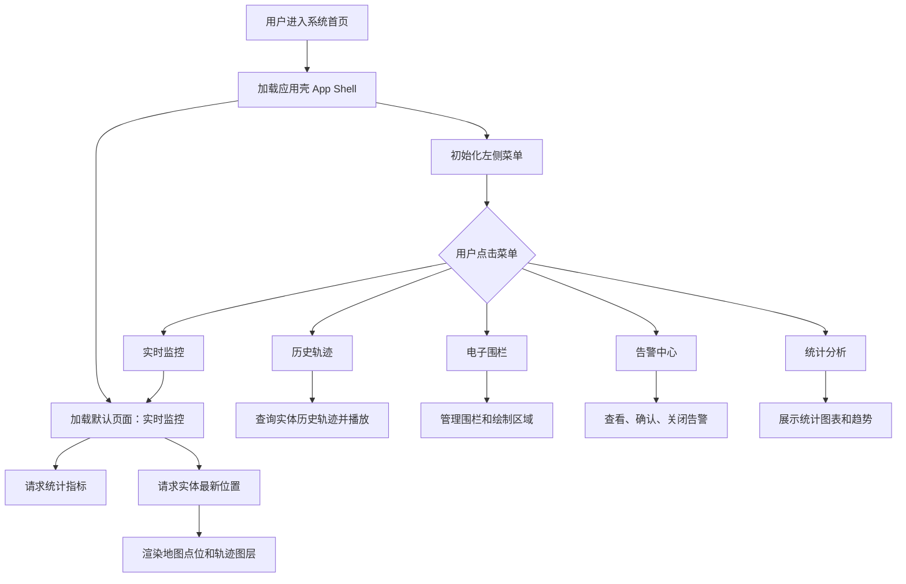
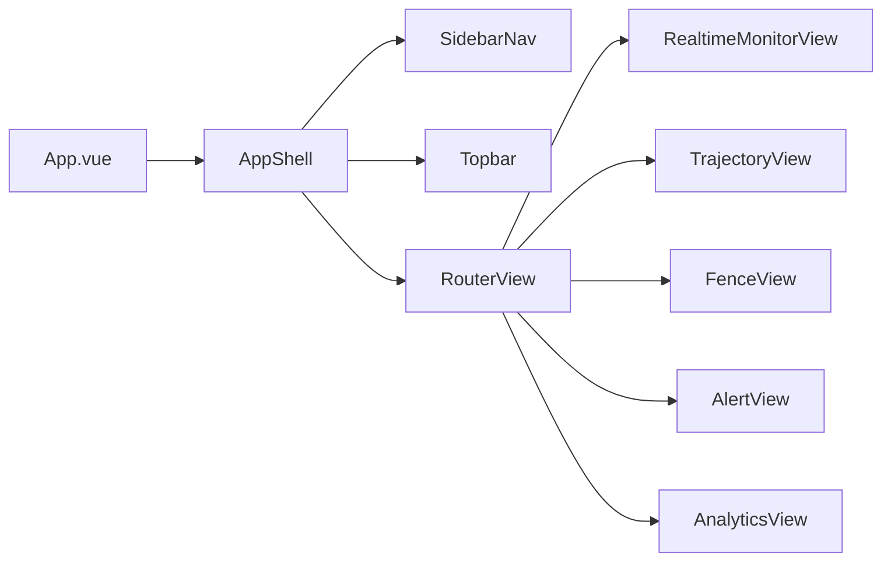
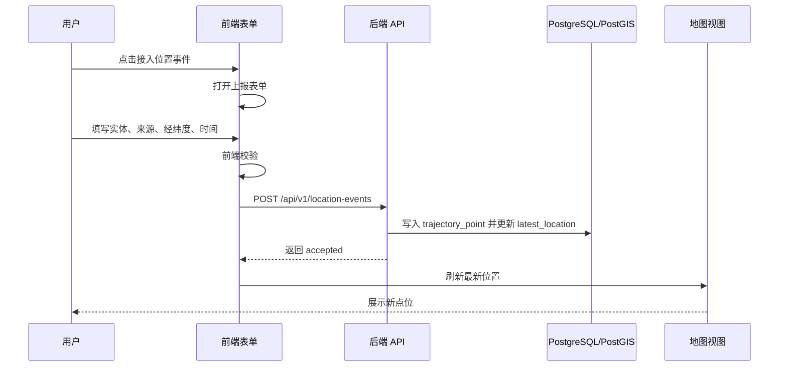

# 前端页面逻辑交互说明

## 1. 文档目标

本文档说明 STIP 管理后台第一阶段页面的交互逻辑、菜单功能、页面状态、接口依赖和后续实现边界。当前前端已接入 Vue Router、后端 API 和模拟位置事件表单，能够完成“接入位置事件 -> 更新最新位置 -> 查询历史轨迹 -> 刷新统计概览”的第一阶段闭环。

## 2. 当前页面现状

当前页面已从 `frontend/admin-web/src/App.vue` 单文件骨架拆分为应用壳、路由页面、API 模块和复用组件，主要包含：

- 左侧导航菜单：实时监控、历史轨迹、电子围栏、告警中心、统计分析。
- 顶部标题区：系统名称、阶段说明、当前页面标题。
- 实时监控：指标卡片、最新位置表格、轻量地图占位层、位置事件上报弹窗。
- 历史轨迹：实体选择、时间范围输入、轨迹点表格。
- 统计分析：统计概览指标。
- 电子围栏、告警中心：已完成菜单路由和占位页，待接入业务接口。

当前限制：

- 地图是 CSS 占位图，不是真实 Leaflet 地图。
- 电子围栏和告警中心还未接入后端接口。
- 指标、最新位置、实体列表、历史轨迹和位置事件提交已接入真实 API。
- 表单使用模拟数据生成器，便于本地测试。

## 3. 页面交互总览

## 4. 页面结构设计

建议后续将当前 `App.vue` 拆分为：

| 组件或页面 | 职责 |
| --- | --- |
| `AppShell.vue` | 应用整体布局，管理侧边栏和内容区域 |
| `SidebarNav.vue` | 菜单渲染、当前路由高亮 |
| `Topbar.vue` | 页面标题、全局操作按钮 |
| `MetricCard.vue` | 指标卡片复用组件 |
| `RealtimeMonitorView.vue` | 实时地图、实体筛选、最新位置 |
| `TrajectoryView.vue` | 历史轨迹查询、轨迹播放 |
| `FenceView.vue` | 围栏列表、围栏绘制、启停管理 |
| `AlertView.vue` | 告警列表、确认、关闭 |
| `AnalyticsView.vue` | 统计图表、趋势分析 |

## 5. 菜单交互逻辑

### 5.1 实时监控

目标：展示系统的核心监控页面。

交互点：

- 页面进入时加载指标数据。
- 页面进入时加载实体最新位置。
- 支持按实体类型筛选：车辆、人员、设备。
- 点击地图点位，展示实体详情。
- 点击 `接入位置事件`，打开位置事件上报表单。

接口依赖：

| 操作 | 接口 |
| --- | --- |
| 加载指标 | `GET /api/v1/analytics/overview` |
| 加载最新位置 | `GET /api/v1/entities/latest-locations` |
| 上报位置事件 | `POST /api/v1/location-events` |
| 附近实体查询 | `GET /api/v1/geo/nearby` |

验收标准：

- 点击菜单后实时监控页面高亮。
- 指标卡片展示真实接口数据。
- 地图展示真实实体点位。
- 点位点击后能查看实体名称、类型、速度、上报时间。

### 5.2 历史轨迹

目标：按实体和时间范围查询历史轨迹，并支持轨迹回放。

交互点：

- 选择实体。
- 选择开始时间和结束时间。
- 点击查询，获取轨迹点。
- 地图绘制轨迹线。
- 支持播放、暂停、倍速播放。
- 支持开启轨迹抽稀。

接口依赖：

| 操作 | 接口 |
| --- | --- |
| 实体下拉 | `GET /api/v1/entities` |
| 查询轨迹 | `GET /api/v1/entities/{id}/trajectory` |
| 导出轨迹 | `GET /api/v1/entities/{id}/trajectory/export` |

验收标准：

- 无实体或时间范围时禁止查询并提示。
- 查询结果为空时显示空状态。
- 轨迹播放不改变原始轨迹数据。
- 点位过多时默认启用抽稀或分页。

### 5.3 电子围栏

目标：管理电子围栏，并支持地图绘制和规则配置。

交互点：

- 查看围栏列表。
- 新建围栏。
- 在地图上绘制圆形或多边形。
- 配置规则类型：进入、离开、停留超时。
- 启用或停用围栏。
- 删除围栏前二次确认。

接口依赖：

| 操作 | 接口 |
| --- | --- |
| 围栏列表 | `GET /api/v1/fences` |
| 创建围栏 | `POST /api/v1/fences` |
| 更新围栏 | `PUT /api/v1/fences/{id}` |
| 删除围栏 | `DELETE /api/v1/fences/{id}` |

验收标准：

- 围栏 geometry 必须合法。
- 围栏创建后地图立即显示。
- 删除围栏后列表和地图同步刷新。
- 禁用围栏不参与告警判断。

### 5.4 告警中心

目标：集中处理围栏、速度、漂移和离线告警。

交互点：

- 查看告警列表。
- 按状态、类型、级别筛选。
- 点击告警查看详情。
- 确认告警。
- 关闭告警并填写备注。

接口依赖：

| 操作 | 接口 |
| --- | --- |
| 告警列表 | `GET /api/v1/alerts` |
| 告警详情 | `GET /api/v1/alerts/{id}` |
| 确认告警 | `POST /api/v1/alerts/{id}/handle` |
| 关闭告警 | `POST /api/v1/alerts/{id}/close` |

验收标准：

- 已关闭告警不能重复关闭。
- 处理告警必须记录处理人和处理时间。
- 高级别告警在列表中有明显状态区分。

### 5.5 统计分析

目标：展示轨迹、实体、告警和数据源质量的统计趋势。

交互点：

- 查看总览指标。
- 查看轨迹点趋势。
- 查看活跃实体趋势。
- 查看告警类型分布。
- 查看停留点 Top N。
- 支持按时间范围筛选。

接口依赖：

| 操作 | 接口 |
| --- | --- |
| 统计概览 | `GET /api/v1/analytics/overview` |
| 轨迹趋势 | `GET /api/v1/analytics/trajectory-trend` |
| 告警趋势 | `GET /api/v1/analytics/alert-trend` |
| 停留点统计 | `GET /api/v1/analytics/stay-points` |

验收标准：

- 图表加载中、空数据和错误状态完整。
- 时间筛选会刷新所有统计图表。
- 统计口径需要在页面或文档中说明。

## 6. 位置事件上报交互

表单字段：

| 字段 | 必填 | 说明 |
| --- | --- | --- |
| `eventId` | 是 | 事件幂等 ID |
| `entityCode` | 是 | 实体编码 |
| `entityType` | 是 | 实体类型 |
| `sourceType` | 是 | 数据来源 |
| `longitude` | 是 | 经度 |
| `latitude` | 是 | 纬度 |
| `speed` | 否 | 速度 |
| `direction` | 否 | 方向 |
| `accuracy` | 否 | 精度 |
| `eventTime` | 是 | 事件时间 |

## 7. 前端状态管理建议

建议使用 Pinia 拆分状态：

| Store | 状态 |
| --- | --- |
| `useAppStore` | 当前菜单、加载状态、全局错误 |
| `useEntityStore` | 实体列表、实体详情、最新位置 |
| `useTrajectoryStore` | 查询条件、轨迹点、播放状态 |
| `useFenceStore` | 围栏列表、当前绘制围栏 |
| `useAlertStore` | 告警列表、筛选条件、当前告警 |
| `useAnalyticsStore` | 指标、趋势、图表数据 |

## 8. 实现优先级

第一批已实现：

1. Vue Router 菜单切换。
2. 拆分实时监控、历史轨迹、统计分析等路由页面。
3. `接入位置事件` 表单弹窗。
4. 对接 `POST /api/v1/location-events`。
5. 接入最新位置查询、统计概览和历史轨迹查询。

第二批建议实现：

1. 接入真实 Leaflet 地图，替换 CSS 地图占位层。
2. 实现轨迹回放控制条。
3. 围栏列表和新建围栏。
4. 告警列表和处理动作。
5. 统计分析图表。

## 9. 执行风险与错误提示

- 执行风险：地图、围栏和告警继续扩展前，应进一步拆出地图图层、表格和表单组件。
- 交互风险：围栏和告警目前是占位页，需要在菜单可点击后尽快补齐业务动作。
- 数据风险：地图点位必须来自后端最新位置接口，不能长期使用静态点位。
- 性能风险：历史轨迹点位过多时必须分页、抽稀或按层级加载。
- 错误风险：前端经纬度输入必须和后端一致，统一使用 `longitude, latitude`。

## 10. 下一步

1. 接入真实 Leaflet 地图，替换 CSS 地图占位层。
2. 实现围栏列表、围栏创建和告警处理接口。
3. 补充 Playwright 或组件测试，覆盖菜单切换和位置事件表单。
